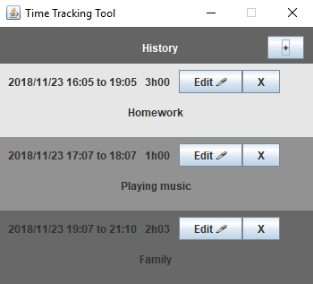
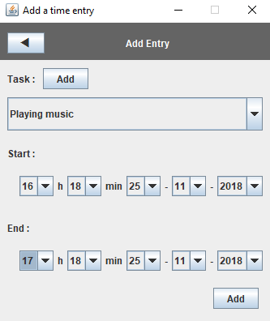
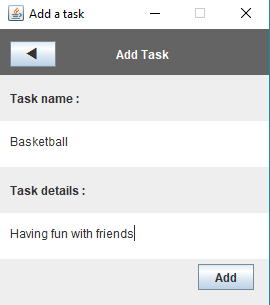
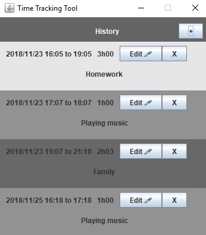

# time-tracking-tool
Laurea University - Java Final project

This tool allows you to track the time you spend on different activities. You will be able to count how many hours you spent on a specific task and you might find time that is not correctly spent.

## How to use it

When you start the software, you can add a new entry by pressing the Add button.

The next step is to select a specific task. This can be one that is already in the database or you can add a new task that will be stored in the database.

Choose the starting time and the ending time and add your new entry.

Whenever you are ending an activity, remember to add your entry so that you can analyze how you spend your time.
